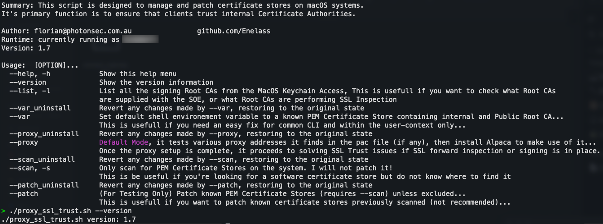
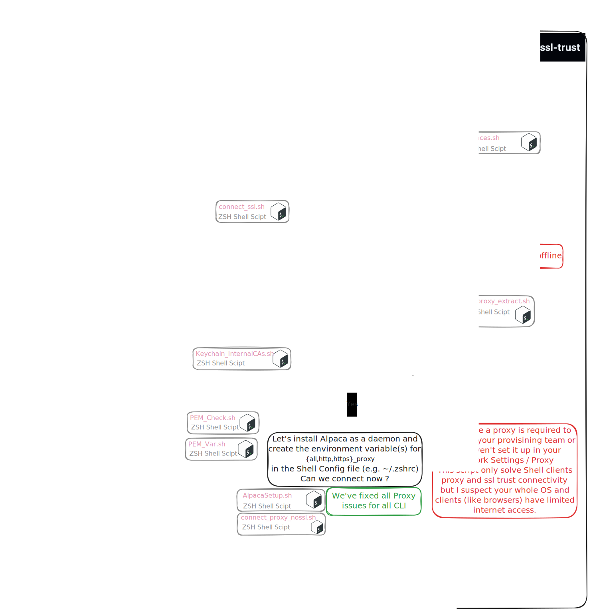
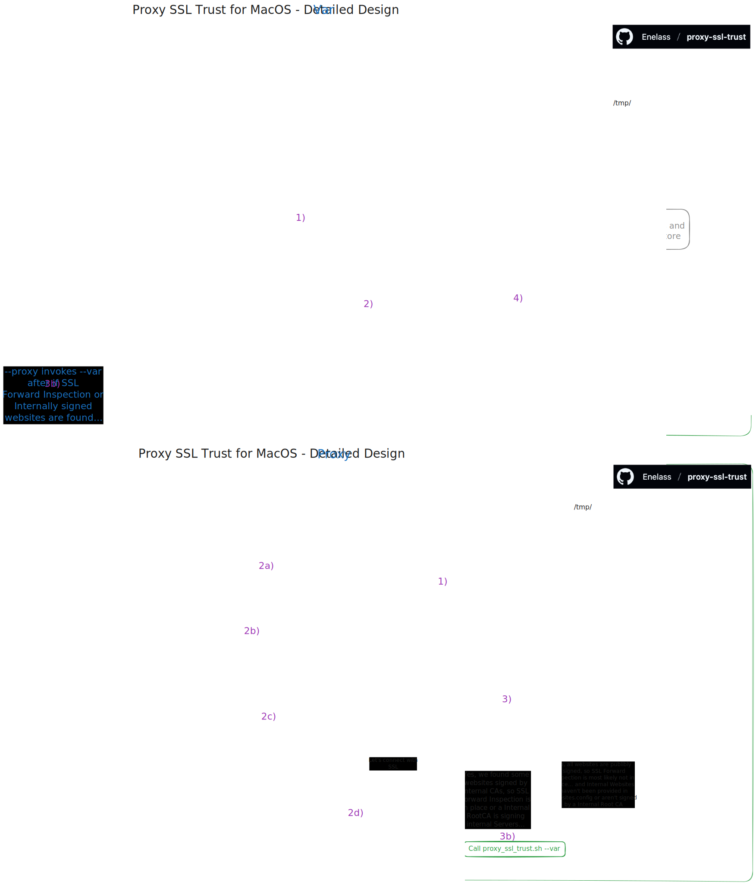
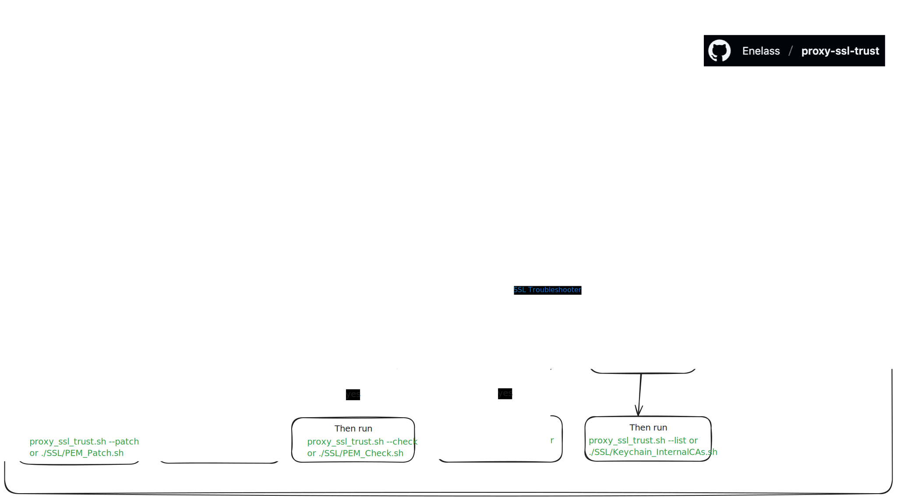

<p align="center">
  
</p>


## Description

**The one command-line proxy and TLS trust fix for CLIs on macOS.**

Tired of CLI tools failing with certificate errors behind corporate proxies? This automated suite detects your proxy configuration, extracts internal CAs from Keychain Access, and configures all CLI tools to work seamlessly with corporate network security. Run one command and forget about `SSL_CERT_FILE`, proxy variables, and certificate verification errors.

## Requirements

  

### Getting Started
The following command will download the suite of tools to `~/Applications/proxy-ssl-trust`. It will then execute the default option, equivalent to running `./Proxy_SSL_Trust.sh --proxy`, which configures macOS CLI to use a proxy and PAC file, and addresses SSL trust issues.

```zsh
/bin/zsh -c "$(curl -fsSL https://raw.githubusercontent.com/Enelass/proxy-ssl-trust/refs/heads/main/lib/download_run_me.sh)"
```

### General Usage

```zsh
~/Applications/proxy-ssl-trust/Proxy_SSL_Trust.sh [OPTION]...
```

### Options

- `--help, -h`: Show the help menu.
- `--version, -v`: Show the version information.
- `--list, -l`: List all the signing Root CAs from the macOS Keychain Access. This is useful to check what Root CAs are supplied or performing SSL Inspection.
- `--scan, -s`: Scan for PEM Certificate Stores on the system without patching. Useful to locate software certificate stores.
- `--var`: Set default shell environment variable to a known PEM Certificate Store containing internal and Public Root CA. Useful for quick fixes in user context.
- `--var_uninstall`: Revert any changes made by `--var`, restoring the original state.
- `--patch, -p`: Patch known PEM Certificate Stores (requires `--scan`). Useful for patching known certificate stores (not recommended).
- `--patch_uninstall`: Revert any changes made by `--patch`, restoring the original state.
- `--proxy`: Set up proxy and PAC file & install Alpaca as a daemon (DEFAULT).
- `--proxy_uninstall`: Uninstall proxy and PAC settings.



## Workflows

### --proxy (High Level)


### --proxy (Detailed Design)


### Standalone Components 



### Runtime video - Watch it in action...
[](https://www.youtube.com/watch?v=XUoyQP0hMX0)


### Examples

1. **Show Help Menu**:
    ```zsh
    ./Proxy_SSL_Trust.sh --help
    ```

2. **Show Version Information**:
    ```zsh
    ./Proxy_SSL_Trust.sh --version
    ```

3. **List Root CAs from Keychain Access**:
    ```zsh
    ./Proxy_SSL_Trust.sh --list
    ```
    This is an alias for `./SSL/Keychain_InternalCAs.sh`

4. **Scan for PEM Certificate Stores**:
    ```zsh
    ./Proxy_SSL_Trust.sh --scan
    ```
    This is an alias for `./SSL/PEM_Scan.sh`

5. **Set Environment Variable for Certificate Store**:
    ```zsh
    ./Proxy_SSL_Trust.sh --var
    ```
    This is an alias for `./SSL/PEM_Var.sh`

6. **Patch Known PEM Certificate Stores**:
    ```zsh
    ./Proxy_SSL_Trust.sh --scan
    ./Proxy_SSL_Trust.sh --patch
    ```
    Note: Requires running --scan first to identify certificate stores. For testing only (not recommended).

7. **Set up Proxy and PAC File**:
    ```zsh
    ./Proxy_SSL_Trust.sh --proxy
    ```
    This is an alias for `./proxy/connect_noproxy.sh`

## Logging

Log files are created in `/tmp` directory with the name `Proxy_SSL_Trust.log`.

## Version

- .7
- **Initial Release Date**: 19-Sep-2024
- **Last Release Date**: 30-Mar-2025


