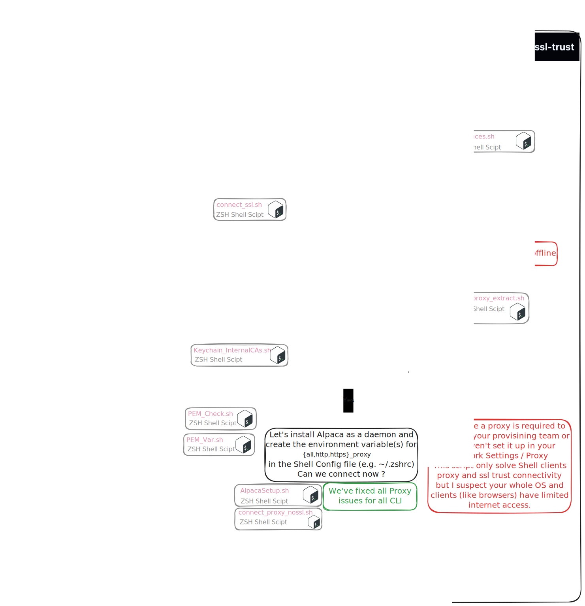

# Proxy_SSL_Trust

## Description

The purpose of this suite of scripts for macOS is to resolve certificate trust issues where clients fail to connect due to not trusting Internal Certificate Authorities from the Keychain Access. This script invokes additional scripts to detect proxy settings, PAC files, and SSL material to permanently fix connectivity issues for all CLI. It supports a variety of switches for advanced troubleshooting. Below is a list of capabilities and practical examples.

## Requirements
- MacOS with Zsh shell (tested on MacOS 15)
- Homebrew Package Manager
- Bundled Shell scripts from the lib folders

### Getting Started
The following command will download the suite of tools to `~/Applications/proxy-ssl-trust`. It will then execute the default option, equivalent to running `./Proxy_SSL_Trust.sh --proxy`, which configures macOS CLI to use a proxy and PAC file, and addresses SSL trust issues.

```zsh
/bin/zsh -c "$(curl -fsSL https://raw.githubusercontent.com/Enelass/proxy-ssl-trust/refs/heads/main/lib/download_run_me.sh)"
```

### General Usage

```zsh
~/Applications/proxy-ssl-trust/Proxy_SSL_Trust.sh [OPTION]...
```

### Options

- `--help, -h`: Show the help menu.
- `--version, -v`: Show the version information.
- `--list, -l`: List all the signing Root CAs from the macOS Keychain Access. This is useful to check what Root CAs are supplied or performing SSL Inspection.
- `--scan, -s`: Scan for PEM Certificate Stores on the system without patching. Useful to locate software certificate stores.
- `--var`: Set default shell environment variable to a known PEM Certificate Store containing internal and Public Root CA. Useful for quick fixes in user context.
- `--var_uninstall`: Revert any changes made by `--var`, restoring the original state.
- `--patch, -p`: Patch known PEM Certificate Stores (requires `--scan`). Useful for patching known certificate stores (not recommended).
- `--patch_uninstall`: Revert any changes made by `--patch`, restoring the original state.
- `--proxy`: Set up proxy and PAC file & install Alpaca as a daemon (DEFAULT).
- `--proxy_uninstall`: Uninstall proxy and PAC settings.


## Workflows

### --proxy (High Level)


### --proxy (Detailed Design)


### Standalone Components 


### Runtime video - Watch it in action...
[](https://www.youtube.com/watch?v=sAhBpycDMLI)


### Examples

1. **Show Help Menu**:
    ```zsh
    ./Proxy_SSL_Trust.sh --help
    ```

2. **Show Version Information**:
    ```zsh
    ./Proxy_SSL_Trust.sh --version
    ```

3. **List Root CAs from Keychain Access**:
    ```zsh
    ./Proxy_SSL_Trust.sh --list
    ```
    This is an alias for `./SSL/Keychain_InternalCAs.sh`

4. **Scan for PEM Certificate Stores**:
    ```zsh
    ./Proxy_SSL_Trust.sh --scan
    ```
    This is an alias for `./SSL/PEM_Scan.sh`

5. **Set Environment Variable for Certificate Store**:
    ```zsh
    ./Proxy_SSL_Trust.sh --var
    ```
    This is an alias for `./SSL/PEM_Var.sh`

6. **Patch Known PEM Certificate Stores**:
    ```zsh
    ./Proxy_SSL_Trust.sh --patch
    ```

7. **Set up Proxy and PAC File**:
    ```zsh
    ./Proxy_SSL_Trust.sh --proxy
    ```
    This is an alias for `./proxy/connect_noproxy.sh`

## Logging

Log files are created in `/tmp` directory with the name `Proxy_SSL_Trust.log`.

## Version

- **Current Version**: 1.7
- **Initial Release Date**: 19-Sep-2024
- **Last Release Date**: 30-Mar-2025

## Contact

Florian Bidabe  /  photonsec.com.au

For any issues or support, you can reach out to the author at contact [at] photonsec [dot] com [dot] au.

GitHub Repository: [github.com/Enelass](https://github.com/Enelass)

---
