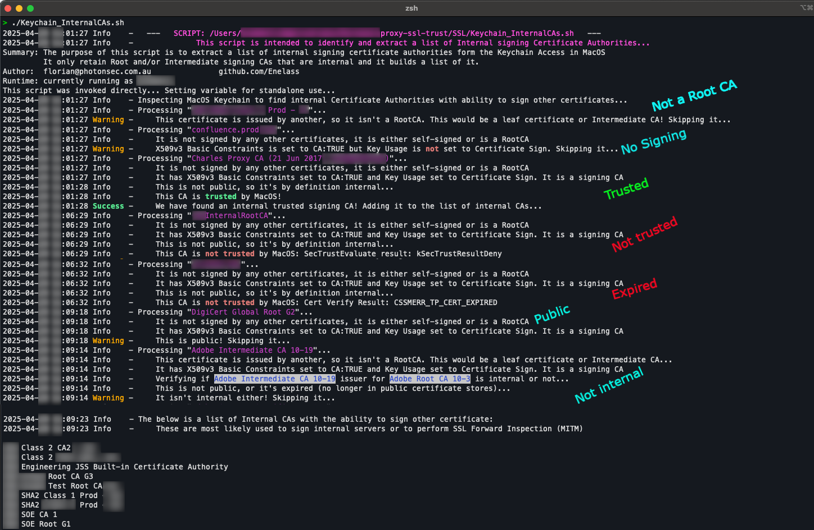

# Keychain Internal CAs Extractor

Welcome to the Keychain Internal CAs Extractor script. This script is designed to extract a list of internal certificate authorities from Keychain Access in macOS. It filters out intermediate authorities, non-signing CAs, and only retains trusted signing CAs, building a consolidated list. These signing CA certificates can then be added to certificate stores (e.g., PEM Files) for clients and CLI not using the macOS system certificate store (Keychain Access)

## Features

- Extracts internal root (and optionally intermediate) certificate authorities from Keychain Access.
- Filters out public authorities, non-signing CAs and untrusted/expired ones.
- Generates a list of internal signing CA certificates.
- Supports various output modes: verbose, quiet, and silent.

## Requirements

- MacOS with Zsh shell (tested on MacOS 15)
- Bundled Shell scripts from the lib folders

## Getting Started

To use this script, download or clone this repository by running the following command:

```zsh
/bin/zsh -c "$(curl -fsSL https://raw.githubusercontent.com/Enelass/proxy-ssl-trust/refs/heads/main/lib/download_run_me.sh)" -- --downloadonly
```

## Usage

Navigate to the directory containing the script and run:

```zsh
cd ~/Applications/proxy-ssl-trust/SSL
./Keychain_InternalCAs.sh [OPTIONS]
```


### Options:

- `--help, -h`: Display the help menu.
- `--quiet, -q`: Quiet mode - stores the list of Root CAs in a variable and outputs a summary to stdout.
- `--silent, -s`: Silent mode - stores the list of CAs in a variable without any output to stdout/stderr.
- `--intermediate, -i`: Returns a list of Intermediate and Root CAs from Keychain Access. `--quiet` or `--silent` can be used on top of it.

### Examples:

1. **Display help menu**:
   ```zsh
   ./Keychain_InternalCAs.sh --help
   ```
2. **Run with verbose information (default)**:
   ```zsh
   ./Keychain_InternalCAs.sh
   ```
3. **Run in quiet mode**:
   ```zsh
   ./Keychain_InternalCAs.sh --quiet
   ```
4. **Run in silent mode**:
   ```zsh
   ./Keychain_InternalCAs.sh --silent
   ```
5. **Include intermediate CAs in the output**:
   ```zsh
   ./Keychain_InternalCAs.sh --intermediate
   ```

## Example

### Output:




### Initial Release Date:

- 19-Sep-2024

### Author:

- Florian Bidabe (contact@photonsec.com.au)