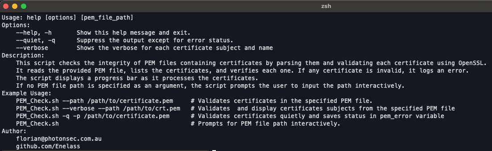
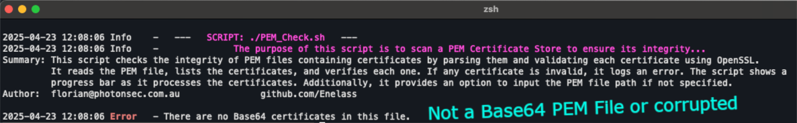
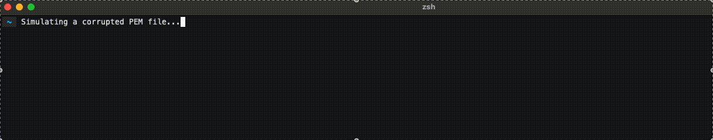

# PEM_Check.sh

## Description

This script checks the integrity of PEM files containing certificates by parsing them and validating each certificate using OpenSSL. It reads the provided PEM file, lists the certificates, and verifies each one. If any certificate is invalid, it logs an error. The script displays a progress bar as it processes the certificates.

## Requirements

- MacOS with Zsh shell (tested on MacOS 15)
- Bundled Shell scripts from the lib folders

## Getting Started

To use this script, download or clone this repository by running the following command:

```zsh
/bin/zsh -c "$(curl -fsSL https://raw.githubusercontent.com/Enelass/proxy-ssl-trust/refs/heads/main/lib/download_run_me.sh)" -- --downloadonly
```

## Usage
Navigate to the directory containing the script and run:

```zsh
cd ~/Applications/proxy-ssl-trust/SSL
./PEM_Check.sh [OPTIONS]


Usage: PEM_Check.sh [options] [pem_file_path]

Options:
    --help, -h       Show this help message and exit.
    --quiet, -q      Suppress the output except for error status.
    --verbose        Shows the verbose for each certificate subject and name

Example Usage:
    PEM_Check.sh --path /path/to/certificate.pem     # Validates certificates in the specified PEM file.
    PEM_Check.sh --verbose --path /path/to/crt.pem   # Validates and display certificates subjects from the specified PEM file
    PEM_Check.sh -q -p /path/to/certificate.pem      # Validates certificates quietly and saves status in pem_error variable
    PEM_Check.sh                                     # Prompts for PEM file path interactively.
```



## Description

The script performs the following tasks:

1. Reads the provided PEM file and checks if it contains any certificates.
2. Parses the PEM file and extracts all the certificates.
3. Validates each certificate using OpenSSL.
4. Displays a progress bar as it processes the certificates.
5. Logs any issues found with the certificates.
6. Provides an option to display the subjects of the certificates (if the `--verbose` option is used).

## Example Output

Success - This certificate store is valid and contains no eroneous Base 64 certificate


Failure - Not a PEM File containing Base 64 certificates


Failure - Valid PEM file but containing corrupted Certificate entries


## Requirements

- The script requires the `openssl` command-line tool to be installed on the system.
- The script is written in Zsh and may not work with other shell environments without modifications.

## Author

- Florian (florian@photonsec.com.au)
- GitHub: https://github.com/Enelass