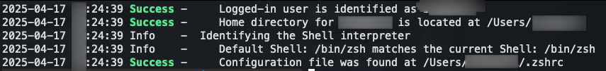
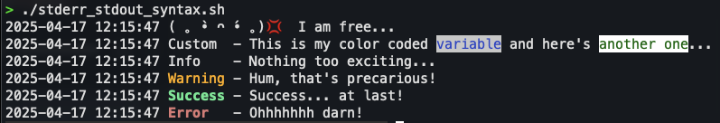

# MacOS Scripts Repository

## Overview

This repository contains useful scripts designed to improve ZShell scripts UX/UI on macOS.
The scripts include tasks such as displaying spinners, logging messages, managing output verbosity and colors, and identifying user-context even if ran as root/sudo.

## Table of Contents
- [MacOS Scripts Repository](#macos-scripts-repository)
  - [Overview](#overview)
  - [Table of Contents](#table-of-contents)
  - [Scripts](#scripts)
    - [Identifying User Context](#identifying-user-context)
    - [Waiting Pattern (Spinner)](#waiting-pattern-spinner)
    - [Logging with Colors](#logging-with-colors)
    - [Managing Output Verbosity](#managing-output-verbosity)
  - [Usage Examples](#usage-examples)
    - [Identifying User Context Example](#identifying-user-context-example)
    - [Spinner Example](#spinner-example)
    - [Logging Example](#logging-example)
    - [Managing Output Verbosity Example](#managing-output-verbosity-example)


## Scripts

### Identifying User Context

This script detects:
- The shell interpreter you use (e.g., zsh, bash).
- The path to your home directory.
- The path to your shell configuration file.

### Waiting Pattern (Spinner)

This script shows a spinner while you wait for long tasks to finish. It helps indicate that something is in progress.

### Logging with Colors

This script logs messages with different colors to show different types of messages like info, warnings, success, and errors.

### Managing Output Verbosity

This script can hide or show the output of commands to make your terminal less cluttered.

## Usage Examples

### Identifying User Context Example

```zsh
#!/bin/zsh
local script_dir=$(dirname $(realpath $0))
source "$script_dir/stderr_stdout_syntax.sh"

default_user
shell_config
```


### Spinner Example

```zsh
# Start the spinner with a custom message
start_spinner "Please wait..."

# Simulate a long task
sleep 5

# Stop the spinner
stop_spinner
```
<video controls src="./assets/spinner.m4v" title="Spinner"></video>

### Logging Example

```zsh
log "This is a regular log message."
logI "This is an info message."
logW "This is a warning message."
logS "This is a success message."
logE "This is an error message."
```



### Managing Output Verbosity Example

```zsh
# Hide output
quiet

# Commands with hidden output
echo "This won't be shown."

# Show output again
unquiet

# Commands with shown output
echo "Output is visible again."
```